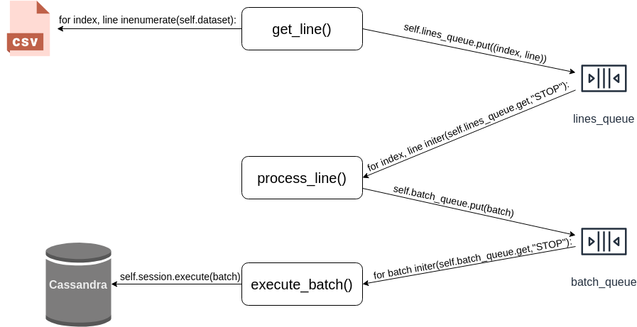

## MultiDC Cassandra cluster on Docker Services

#### Requirements
  * 16GB RAM (otherwise tune JVM opts or decrease the number of Cassandra nodes)
  * Docker Engine 18.06.0+
  * `pip install cassandra-driver Jinja2`
  * sample dataset: San Francisco Budget https://data.sfgov.org/d/xdgd-c79v
  
#### Binaries:
* **start_cluster.sh:** create dirs + `docker stack deploy`
* **destroy_cluster.sh**: `docker stack rm` (data could be preserved) 
* **cqlsh.sh:** run new docker instance and connect to existing node 
* **node_connect.sh:** connect to a particular node `/bin/bash`
---
#### How CSVMultiprocessing works:

